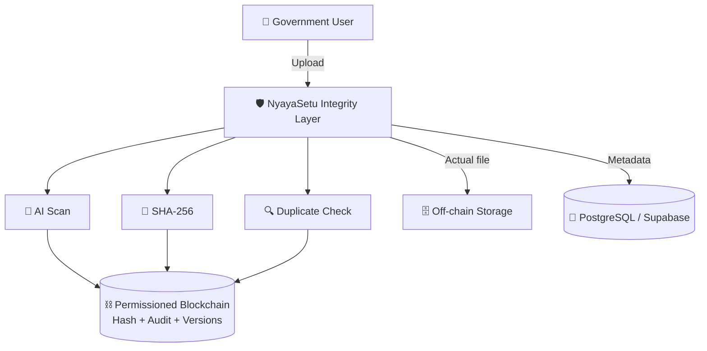

<div align="center">


# ⚖️ NyayaSetu

### **Blockchain-Backed Digital Evidence Integrity & AI-Assisted Tamper-Risk Detection System**

[](https://react.dev)
[](https://vite.dev)
[](https://nodejs.org)
[](https://expressjs.com)
[](https://soliditylang.org)
[](https://hardhat.org)
[](https://www.postgresql.org)
[](https://en.wikipedia.org/wiki/SHA-2)
[](https://www.python.org)

</div>

**🔐 A cryptographic integrity and audit layer for digital evidence.**

NyayaSetu is a secure digital evidence integrity and audit system designed as an **add-on layer** for existing government systems such as **CCTNS / ICJS**. It does not replace existing evidence-management infrastructure. Instead, it adds:

- 🔑 Cryptographic integrity verification (SHA-256)
- 🤖 AI-assisted pre-upload tamper-risk screening
- ⛓️ Blockchain-backed auditability
- 🗂️ Version tracking
- 🚨 Tamper detection

> 💡 **Core idea:** Store the evidence off-chain, store its cryptographic fingerprint and audit history on-chain, and continuously verify that the current evidence still matches the registered fingerprint.

> 🚧 **Status:** Prototype. The local blockchain setup (Ganache) and the demonstration tampering feature are intended for demos and development, not production use.

---

## Screenshots

<div align="center">

### `Dashboard`


<div align="center">

### `All Records`


<div align="center">

#### `Original FIR`


<div align="center">

### `Tampered FIR`


<div align="center">

### `Upload Document`


<div align="center">

#### `Uploading a Tampered Document`


<div align="center">

### `Re-add The Doc After Admin Approaval`


### `Original FIR Copy`


### `Changed FIR Copy`


### `Audit Activity`


<div align="center">

### `Chain Explorer`


<div align="left">
       
---
## 📑 Table of Contents

- [Problem Statement](#-problem-statement)
- [Key Features](#-key-features)
- [How It Works](#-how-it-works)
- [Architecture](#-architecture)
- [Blockchain Role](#-blockchain-role)
- [Tamper Detection](#-tamper-detection)
- [AI Screening Component](#-ai-screening-component)
- [Version Control](#-version-control)
- [Access and Audit History](#-access-and-audit-history)
- [Backend](#-backend)
- [Frontend](#-frontend)
- [Technology Stack](#-technology-stack)
- [Trust Model and Limitations](#-trust-model-and-limitations)
- [Production Considerations](#-production-considerations)

---

## 🎯 Problem Statement

Digital evidence can pass through multiple systems and users during investigation and legal proceedings. Conventional databases can record metadata and access permissions, but NyayaSetu adds a separate cryptographic layer that makes the integrity history of evidence **independently verifiable**.

---

## ✨ Key Features

| Feature | Description |
|---|---|
| 🔑 **SHA-256 fingerprinting** | Every evidence file is hashed on upload and can be re-hashed at any time for verification. |
| 🤖 **AI pre-upload screening** | Analyses JPEG, PNG and PDF files for tamper-risk signals (ELA, metadata/EXIF, content extraction) and flags files for human review. |
| 🔍 **Duplicate and similarity detection** | Exact SHA-256 matching plus content/visual similarity checking (threshold of approximately 0.93) to identify potentially modified duplicates. |
| ⛓️ **Blockchain registration** | Document hash and key audit information are registered on a permissioned blockchain. |
| 🗄️ **Off-chain file storage** | Evidence files are stored in conventional storage, not on-chain. |
| 🗂️ **Version tracking** | Corrections and updates create new versions, each with its own hash and blockchain record. |
| 📜 **Audit trail** | Registration, viewing, downloading, sharing and version additions are recorded chronologically. |
| 🚨 **Tamper detection** | Re-computed hash is compared with the on-chain hash to report `MATCH` or `MISMATCH`. |
| 👥 **Role-based access** | Role-based authentication, with OpenZeppelin `AccessControl` in the smart contract. |

---

## ⚙️ How It Works

```
Upload → AI screening → SHA-256 generation → duplicate/similarity check
       → blockchain registration → off-chain file storage → verification/audit
```

When an evidence file is uploaded:

1. 📥 The backend receives the file.
2. 🔑 The system calculates its **SHA-256** hash.
3. 🤖 An AI service performs a **pre-upload tamper-risk screening** using signals such as ELA, metadata/EXIF and content extraction.
4. 🔍 The system performs **duplicate detection**:
   - Exact SHA-256 matching.
   - Content/visual similarity checking, using a threshold of approximately **0.93** to identify potentially modified duplicates.
5. 🆔 A unique **document ID** is assigned.
6. ⛓️ The document's hash and important audit information are registered on the **permissioned blockchain**.
7. 🗄️ The actual evidence file is stored **off-chain**.
8. 🐘 Metadata is stored in **PostgreSQL / Supabase**.
9. 🖥️ The frontend displays the registered evidence record and its integrity status.

---

## 🏗️ Architecture

NyayaSetu uses a hybrid on-chain / off-chain architecture.



| Layer | Stores |
|---|---|
| ⛓️ **Blockchain** | Document ID, SHA-256 hash, uploader information, timestamps, version history, access events, blockchain transactions |
| 🗄️ **Off-chain storage** | The actual evidence files |
| 🐘 **PostgreSQL / Supabase** | Evidence metadata |

---

## ⛓️ Blockchain Role

The blockchain acts as the **tamper-evident integrity anchor and audit trail**.

It stores:

- 🆔 Document ID
- 🔑 SHA-256 hash
- 👤 Uploader information
- 🕐 Timestamps
- 🗂️ Version history
- 👁️ Access events
- 🔗 Blockchain transactions

The actual evidence file is **not** stored on-chain, because evidence files can be large and are better kept in conventional storage.

The prototype uses **Ganache + Hardhat + Solidity** locally, with **OpenZeppelin AccessControl**. A production deployment could use a permissioned blockchain such as **Hyperledger Fabric**.

---

## 🚨 Tamper Detection

If a file is later modified, the system recalculates its SHA-256 and compares it against the registered value:

```
Original / on-chain hash ≠ current file hash  →  MISMATCH
```

Example:

```
Original file  →  SHA-256 = ABC123  →  Blockchain
Modified file  →  SHA-256 = XYZ789  →  Compare with blockchain  →  MISMATCH
```

The prototype includes a **demonstration tampering mechanism**:

- 💾 The original registered file is preserved.
- ✏️ The demo can modify the stored file and then run verification.
- ♻️ The original file can be restored, after which the hash matches again.

---

## 🤖 AI Screening Component

The AI module is a **pre-upload risk screening layer**. It analyses supported **JPEG, PNG and PDF** files using indicators including:

- 🖼️ Error Level Analysis (ELA)
- 🏷️ Metadata / EXIF information
- 📝 Content extraction
- 🧩 Other file-level signals

It returns statuses such as:

- ✅ `clean`
- ⚠️ `review_recommended`

The AI **does not** automatically declare a document authentic or fake, and it does not replace blockchain verification. It provides a risk flag for **human review** before registration.

---

## 🗂️ Version Control

Evidence is never overwritten when a legitimate correction or updated version is required. Instead:

```
Document
 ├── Version 1
 ├── Version 2
 ├── Version 3
 └── ...
```

Each version can have its own hash and blockchain record, maintaining a traceable history.

---

## 📜 Access and Audit History

The system records important evidence-related activities, including:

- 📝 Registration
- 👁️ Viewing
- ⬇️ Downloading
- 🤝 Sharing
- ➕ Version additions

These activities can be represented in the blockchain audit trail, creating a chronological record of interactions with the evidence.

---

## 🔧 Backend

The Node.js / Express backend provides APIs for:

- 🔐 Authentication / login
- 📤 Evidence upload
- 📋 Document listing
- 📄 Document details
- ✔️ SHA-256 verification
- ➕ Version creation
- 🕰️ Evidence history
- 📝 Access logging
- 🧪 Demonstration tampering
- ♻️ Original-file restoration
- 👁️ Evidence file preview

The backend communicates with:

- 🐘 **PostgreSQL / Supabase** for metadata
- ⛓️ **Blockchain smart contract** for integrity and audit records
- 🤖 **AI service** for pre-upload analysis
- 🖥️ **Frontend** for user interaction

---

## 🖥️ Frontend

The React + Vite frontend provides the following interfaces:

- 🔐 Login
- 📊 Dashboard
- 📚 All Records
- 📤 Evidence Upload
- 🔎 Evidence Details
- 🕰️ Activity / Audit History
- 📥 Review Queue
- 🔗 Blockchain / Chain Explorer
- ⚙️ Settings
- 👤 Profile

The **Evidence Details** view can show:

- 🔑 Original / on-chain SHA-256
- 🔑 Current SHA-256
- ✅ / ❌ `MATCH` / `MISMATCH` status
- 📁 Original file and current file
- 🤖 AI risk status
- ⛓️ Blockchain transaction information
- 🗂️ Version and history information

---

## 🧰 Technology Stack

| Component | Technology |
|---|---|
| 🖥️ Frontend | React, Vite |
| 🔧 Backend | Node.js, Express |
| 🐘 Database | PostgreSQL / Supabase |
| ⛓️ Blockchain | Solidity, Hardhat, Ganache |
| 📜 Smart contracts | OpenZeppelin AccessControl |
| 🤖 AI service | Separate analysis service |
| 🔑 Cryptography | SHA-256 |
| 🗄️ File storage | Off-chain server storage |
| 👥 Authentication | Role-based prototype authentication |

---

## ⚠️ Trust Model and Limitations

- 🔎 **Blockchain does not prove that a document is factually genuine.** It proves whether the *current digital bytes* match the *previously registered cryptographic fingerprint*, subject to the trust model of the permissioned network.
- 🤖 The AI screening is a **risk indicator**, not a verdict. Final judgement rests with human reviewers.
- 📎 AI screening currently supports **JPEG, PNG and PDF** files.
- 🕵️ A file that was already altered *before* registration will be registered as-is; the AI screening step exists to help catch such cases for review.
- 🚧 This is a **prototype**. Authentication is role-based prototype authentication, and the blockchain runs locally on Ganache.

---

## 🚀 Production Considerations

- 🌐 Replace the local Ganache network with a permissioned blockchain such as **Hyperledger Fabric**.
- 🏛️ Integrate as an add-on layer with existing systems such as **CCTNS / ICJS**, rather than replacing them.
- 🧹 Remove or disable the demonstration tampering and restore endpoints.
- 🔐 Replace prototype authentication with the deployment's production identity and access management.

---

## 📄 License

MIT License

Copyright (c) 2026 hackerearthai

Permission is hereby granted, free of charge, to any person obtaining a copy
of this software and associated documentation files (the "Software"), to deal
in the Software without restriction, including without limitation the rights
to use, copy, modify, merge, publish, distribute, sublicense, and/or sell
copies of the Software, and to permit persons to whom the Software is
furnished to do so, subject to the following conditions:

The above copyright notice and this permission notice shall be included in all
copies or substantial portions of the Software.

THE SOFTWARE IS PROVIDED "AS IS", WITHOUT WARRANTY OF ANY KIND, EXPRESS OR
IMPLIED, INCLUDING BUT NOT LIMITED TO THE WARRANTIES OF MERCHANTABILITY,
FITNESS FOR A PARTICULAR PURPOSE AND NONINFRINGEMENT. IN NO EVENT SHALL THE
AUTHORS OR COPYRIGHT HOLDERS BE LIABLE FOR ANY CLAIM, DAMAGES OR OTHER
LIABILITY, WHETHER IN AN ACTION OF CONTRACT, TORT OR OTHERWISE, ARISING FROM,
OUT OF OR IN CONNECTION WITH THE SOFTWARE OR THE USE OR OTHER DEALINGS IN THE
SOFTWARE.


